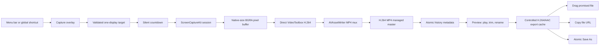

# Clip technical architecture

This document records the implementation shape behind [spec.md](spec.md). The product specification remains the source of truth for behavior; this file explains ownership, dependencies, and verification boundaries.

## Platform baseline

- Native Swift 6 language mode with complete concurrency checking
- Apple Silicon, macOS 15+
- SwiftUI for menu-bar, onboarding, settings, Preview, recording status, and History
- AppKit for status-item/window coordination and multi-display capture overlays
- ScreenCaptureKit for display pixels, cursor, system audio, and microphone delivery
- AVFoundation/VideoToolbox for H.264/AAC recording, controlled exports, playback, inspection, and synthetic media tests
- App Sandbox and Hardened Runtime; no Accessibility entitlement or third-party runtime
- Apple Development-signed local `Clip.dmg` using free Personal Team `FJ2BS65H3F`; ad-hoc fallback for permission-free CI; no App Store, Developer ID, or notarization pipeline

## Repository boundaries

`Packages/ClipCore` is the platform-independent product domain. It owns validated settings, capture geometry, filenames, history metadata/retention, and the recording state machine. It has no AppKit or ScreenCaptureKit dependency.

`Packages/ClipMedia` owns native media mechanics: ScreenCaptureKit discovery/capture, sample retiming, direct VideoToolbox H.264 encoding, AVAssetWriter passthrough MP4 muxing/AAC encoding, AVAssetReader/Writer export, media inspection, and deterministic synthetic media tests.

`Clip` is the macOS application target. It adapts AppKit/SwiftUI events to ClipCore commands and ClipMedia services. `ApplicationCoordinator` is the main-actor composition root; filesystem/history and export work live in actors so UI state never owns raw file mutation.

`ClipTests`, `ClipUITests`, and `ClipTestHelper` cover application adapters, deterministic UI states, and the future owner-approved real-Mac capture checks.

## Recording and sharing flow

The recording state machine starts elapsed time only after the first accepted video frame. Pause windows are retained as half-open source-time intervals, so samples queued during a pause are dropped even if their callback arrives after resume. Completed pause durations are subtracted from every later video and audio timestamp.

Every ScreenRecorder session carries a UUID. Callbacks are accepted only while the matching generation is starting or recording, and the app rechecks the corresponding `RecordingID` before deferred recovery. Start, finish, and cancel are serialized so an old stream cannot mutate a new session.

## Media contracts

Area and application geometry is aligned once to the display's physical-pixel grid. The aligned source rectangle and its even pixel dimensions are then reused by ScreenCaptureKit, the encoder, History, and MP4 metadata. Every complete incoming pixel buffer must match those dimensions exactly; a mismatch is terminal rather than an invitation to silently rescale.

Capture submits each transient ScreenCaptureKit BGRA pixel buffer directly to a VideoToolbox H.264 High-profile compression session. The live policy is real-time quality `0.98`, quality-over-speed priority, resolution/FPS-scaled soft average bitrate, no hard rate cap, no frame reordering, and a two-second GOP. AVAssetWriter's video input is passthrough: it receives the already-compressed sample and only muxes it with AAC into the Rec.709 MP4. Hardware encoding is selected for supported dimensions; VideoToolbox's native software encoder preserves exact oversized modes such as 5K when Apple hardware cannot accept them. Raw frames are never persisted; only the latest pixel buffer is retained transiently so one short two-to-three-interval scheduling gap can be bridged with a held frame without moving any original timestamp.

Video encoder/muxer pressure is absorbed by a small bounded queue. A sustained stall or VideoToolbox frame drop is surfaced as a recording failure, so the master cannot acquire silent timing holes. System and microphone audio may be separate tracks in the managed master so a disappearing source does not require destructive editing.

The sharing exporter uses AVAssetReader and AVAssetWriter rather than opaque export presets. An eligible full-duration Crisp operation byte-copies the quality master. Other Crisp work uses offline VideoToolbox quality `0.98`; Compact uses `0.85` inside its 1080p/30 envelope. Both keep bitrate as a soft target and omit hard data-rate limits. Smallest remains constrained ABR with a one-second hard cap at ten percent headroom. Offline encodes use `RealTime = false`, prioritize quality, and permit frame reordering. Multiple input audio tracks are mixed into one AAC output track, and trim/resize/cadence/audio changes happen in that same generation. A complete temporary sibling is atomically published, so concurrent or failed exports cannot expose a partial destination.

The durable capture setting—not a rounded nominal observation—is the 30/60 FPS ceiling. This keeps a 28.29 FPS variable-rate master from being converted to 28 FPS and preserves exact sample timing whenever the chosen preset does not reduce cadence.

The source master is never edited by trim controls or Remove audio. Cache identity includes recording ID, trim, preset, approximate target, filename, and the per-recording audio preference, so audible and silent exports cannot collide. Save As stages a complete copy inside Clip's managed cache, then writes or atomically replaces only the exact URL authorized by `NSSavePanel`; it never creates an unauthorized temporary sibling in an external folder.

## Storage ownership

Preferences are versioned JSON under Application Support. History is a versioned, atomically written JSON index plus MP4 masters and explicit ownership markers. Only marked Clip-managed files may be removed by retention, Delete, or reconciliation.

Clipboard, promised-drag, and intermediate exports live under Caches and intentionally outlive the immediate operation so another application can consume them. Save As outputs are external user files and are never owned or removed by Clip.

When Keep Original is Off, the successful export is installed atomically at the same managed path and its intrinsic duration, dimensions, frame rate, byte count, and full trim are rebased together. When Do Not Retain is selected, history metadata is removed after a successful share; physical cleanup is coordinated with any open Preview/file consumer and crash leftovers are handled by ownership-aware launch reconciliation.

## Permission model

Reading current permission state is separate from requesting access. Screen Recording is requested only through onboarding or a user-initiated capture. Microphone/system audio remain Off by default and are requested only after the user enables the corresponding setting. Denial does not request Accessibility and does not affect local History/Preview use.

Tests cannot grant macOS privacy access. The owner performs the one-time approvals; subsequent real-Mac acceptance can be unattended. Local permission-backed builds use one certificate-based designated requirement so rebuilds retain their privacy identity; ad-hoc CI builds remain build-specific and may cause macOS to ask again.

## Concurrency and failure invariants

- UI/window/status state is `@MainActor` isolated.
- History and export coordination are actors.
- ScreenCaptureKit callbacks, the VideoToolbox output queue, and AVAssetWriter inputs are protected by explicit locks and session identity.
- No user destination is removed before its complete replacement exists.
- No zero-frame recording becomes a History item.
- A failed capture either discards empty output or attempts to finalize playable material according to the state-machine command.
- A valid finalized MP4 remains discoverable even if later history or Preview presentation fails.
- Stale callbacks, repeated export requests, and delayed paused samples are safe and deterministic.

## Verification layers

`./scripts/typecheck.sh` is the permission-free gate. It runs both Swift-package suites, including direct VideoToolbox H.264 generation/decoding and objective screen-content SSIM/edge/cadence checks, then strict-typechecks and links every app source as an arm64 executable.

`./scripts/test.sh` adds application XCTest; `--ui` adds UI smoke tests. These require the Xcode project driver but do not require privacy prompts when using injected launch modes.

The real-Mac suite uses `ClipTestHelper` as deterministic capture content and a local receiver for promised-file drag/pasteboard validation. Only this layer needs owner-granted Screen Recording/System Audio/Microphone access. External services are not contacted.

`./scripts/package-dmg.sh` creates either the default ad-hoc artifact or, when `CLIP_CODE_SIGN_IDENTITY` is configured, the stable Apple Development-signed Release DMG. `./scripts/verify-dmg.sh` mounts it and validates bundle identity, version, exact signer certificate, stable designated requirement, plist, entitlements, app payload, and Applications shortcut.
