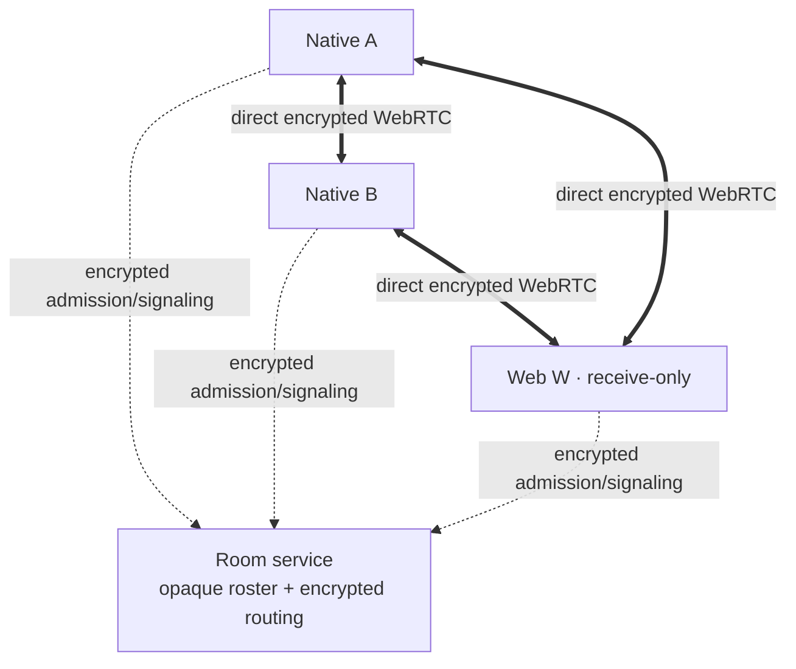
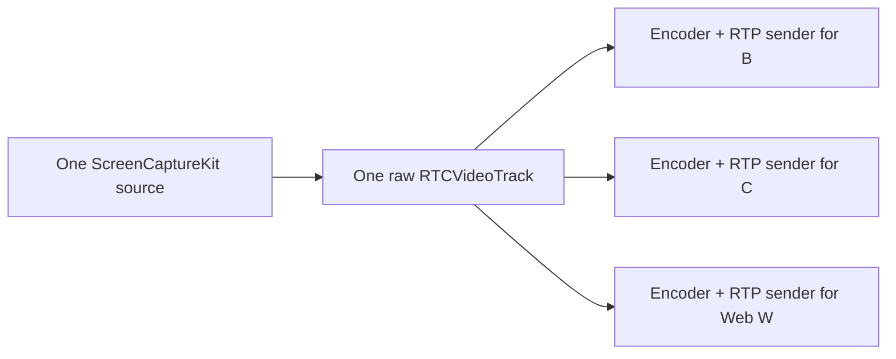

# Clip technical architecture

This document describes the implementation boundaries behind [spec.md](spec.md).
The product specification remains the source of truth for behavior. Detailed
Live Share protocol decisions live in
[server-coordinated-mesh-design.md](docs/server-coordinated-mesh-design.md).

## Platform baseline

- Native Swift 6 with complete concurrency checking
- Apple Silicon and macOS 15+
- SwiftUI for menu-bar, Settings, Preview, History, and Live Share surfaces
- AppKit for status items, native windows, capture overlays, and display/Space
  coordination
- ScreenCaptureKit for display/window pixels, cursor, system audio, and
  microphone delivery
- AVFoundation and VideoToolbox for recording, export, playback, inspection,
  and deterministic media fixtures
- Pinned WebRTC M150 for Live Share ICE, DTLS-SRTP, SCTP DataChannels, Opus,
  congestion control, and video codecs
- Pinned Sparkle 2 for signed application updates
- App Sandbox and Hardened Runtime; Clip never requests Accessibility access

Clip has no helper daemon or bundled FFmpeg-style media executable. WebRTC and
Sparkle are audited third-party runtimes embedded in the app bundle. The Go
Live Share service is deployed separately and is never launched by `Clip.app`.

## Repository boundaries

### Native packages

`Packages/ClipCore` owns platform-independent product state: validated
preferences, capture geometry, filenames, history/retention metadata, and the
recording state machine. It has no AppKit or ScreenCaptureKit dependency.

`Packages/ClipCapture` owns the reusable ScreenCaptureKit boundary: discovery,
source geometry and scale, source-aware 1×/Retina resolution selection, video
sessions, and system-audio sessions. Recording and Live Share use this shared
capture contract.

`Packages/ClipMedia` owns local recording and export mechanics: sample
retiming, direct VideoToolbox H.264/HEVC compression, AVAssetWriter MP4 muxing
and AAC encoding, AVAssetReader/Writer export, media inspection, and synthetic
media fixtures.

`Packages/ClipLiveShare` owns protocol-neutral Live Share models plus the v4
room contract: settings, canonical invites, admission proofs, encrypted member
descriptors, authoritative roster reconciliation, pair identities, source
manifests, friendship/presence, and collaboration messages. It does not own a
concrete WebRTC implementation.

`Packages/ClipLiveShareWebRTC` adapts the Live Share model to the pinned native
WebRTC framework. It owns pair transports, SDP/ICE, DataChannels, fixed media
slots, codec policy, video/audio bridges, sender diagnostics, and remote video
rendering.

### Application and service

`Clip/` is the macOS application target. `ApplicationCoordinator` is the
main-actor composition root. Recording coordination, Preview/History windows,
menu-bar presentation, native Live Share windows, collaboration overlays, and
the server-coordinated room session are application adapters around the five
packages above.

`server/` is an independent Go module. It owns the bounded in-memory opaque
room roster, socket presence, reconnect grace, encrypted pair-signal routing,
friend-presence ciphertext storage, validated ICE configuration, and the
embedded receive-only Web viewer. It never receives media or plaintext room
secrets, identities, SDP/ICE, source metadata, or collaboration content.

`server/web/` is the same-origin browser client. It joins the v4 roster and
creates the same direct pair connection to every participant, but its declared
Web-v1 capability is receive-only: it does not publish media, administer a
room, create friendships, or participate in collaboration.

`ClipTests`, `ClipUITests`, package tests, Go tests, Web tests, and the tools
under `Tools/` cover the layers independently and in composition. The guarded
real-Mac lanes use `ClipTestHelper` and the signed app identity for actual
ScreenCaptureKit, pointer, audio, drag, clipboard, and GUI verification.

## Local recording architecture

Recording is local and does not involve the Live Share service or WebRTC.

```mermaid
flowchart LR
    A["Menu bar or shortcut"] --> B["Capture overlay"]
    B --> C["Validated one-display target"]
    C --> D["ScreenCaptureKit"]
    D --> E["Native-size BGRA frames"]
    E --> F["VideoToolbox H.264 or HEVC"]
    F --> G["AVAssetWriter MP4 mux"]
    G --> H["Managed local master"]
    H --> I["Preview and History"]
    I --> J["H.264/AAC export cache"]
    J --> K["Drag, Copy, or Save As"]
```

Capture geometry is aligned once to the source display's physical-pixel grid.
ScreenCaptureKit, the compression session, History metadata, and MP4 metadata
reuse those exact even dimensions. A complete buffer with unexpected geometry
is rejected rather than silently rescaled.

The recording state machine starts elapsed time on the first accepted video
frame. Pause ranges are represented in source time, so delayed callbacks from
a paused interval are rejected even after resume. Every session has a UUID;
stale callbacks cannot mutate a replacement recording.

ScreenCaptureKit BGRA buffers pass directly into a VideoToolbox compression
session. Clip prefers hardware H.264 High and uses exact-size hardware HEVC
when H.264 cannot represent an oversized native mode. AVAssetWriter receives
the compressed samples through a passthrough input and muxes them with AAC; raw
frames are never persisted.

Preview edits are non-destructive. Crisp, Compact, and Smallest exports use the
source's native even dimensions and captured cadence. An eligible unchanged
Crisp export reuses a compatible H.264 master byte-for-byte. Other operations
use one controlled AVAssetReader/Writer generation and atomically publish only
the complete destination.

## Live Share architecture

Live Share is a clean-slate server-room-v4 complete mesh. Native and Web
participants use the same admission, roster, encrypted pair signaling, and
WebRTC pair machinery. Product capabilities differ by the creator-certified
profile, not by a separate transport.

```mermaid
flowchart TB
    S["Room service\nopaque roster + encrypted routing"]
    A["Native A"]
    B["Native B"]
    W["Web W · receive-only"]

    A -. "encrypted admission/signaling" .-> S
    B -. "encrypted admission/signaling" .-> S
    W -. "encrypted admission/signaling" .-> S

    A <== "direct encrypted WebRTC" ==> B
    A <== "direct encrypted WebRTC" ==> W
    B <== "direct encrypted WebRTC" ==> W
```

For `n` participants, the room contains `n × (n - 1) / 2` peer links: one for
two participants, three for three, and six for the current maximum of four.
Two-person sharing is the expected common case. Four is a tested CPU, thermal,
upstream-bandwidth, and churn boundary—not a WebRTC protocol limit.

The creator controls admission and has the terminal **End Room for Everyone**
action. Ordinary participants leave independently. Creator departure ends the
room; v4 deliberately has no election, successor, quorum, or locked-room
phase. Joining, leaving, or reconnecting reconciles the affected pairs without
replacing unrelated established links.

### Capture and encoding fan-out

Each local shared source has one ScreenCaptureKit session and one stream of raw
frames. The raw frames feed one shared `RTCVideoTrack`, which is attached to a
separate `RTCRtpSender` on every remote peer connection. Standard libwebrtc
therefore owns a separate encoder and congestion controller for each
source/remote-peer edge.

```mermaid
flowchart LR
    C["One ScreenCaptureKit source"] --> R["One raw RTCVideoTrack"]
    R --> EB["Encoder + RTP sender for B"]
    R --> EC["Encoder + RTP sender for C"]
    R --> EW["Encoder + RTP sender for Web W"]
```

This does **not** create another screen capture or disk recording for each
viewer. It does mean CPU work and publisher upload grow with peers, while each
edge can adapt independently to its route. A selected codec is negotiated once
per edge; Clip never starts simultaneous browser-fallback codecs, transcodes,
or creates a second codec encode for that same edge. Native-Web edges require
the selected codec exactly. Native-Native edges may choose one codec from the
documented compatibility preference ladder.

One slow peer cannot backpressure another: each sender favors its latest frame
and owns independent congestion, QP, send-queue, and route statistics. Sender
diagnostics are consequently grouped by local source and recipient rather than
presenting one room-wide encoder value.

### Audio and collaboration

Each Native publisher can send at most one stable 48 kHz stereo Opus track.
Window sharing selects audio at owning-application scope; fullscreen uses
system audio while excluding Clip and optionally selected applications. Every
receiver has independent mute and volume state for each remote publisher.

Pointer, ping, and temporary vector ink travel over authenticated pair
DataChannels. They are source-scoped normalized events rendered locally, not
remote input injection and not pixels burned into the video.

### Trust boundaries

The canonical invite keeps its authorizing material in a URL fragment. The
official clients do not place those secrets in HTTP paths, queries, headers,
ordinary WebSocket messages, or server logs. Admission, descriptors, pair
signaling, source/control messages, and media are authenticated or encrypted
at their appropriate layer.

The service can see IP addresses, timing, room size, opaque identifiers,
ciphertext sizes, and traffic shape, and it can deny service. It cannot decrypt
official-client pair signaling or media. TURN can relay encrypted WebRTC
packets but receives no room authority.

The Web origin is a separate trust boundary: it supplies the Web viewer
JavaScript, so a malicious or compromised origin could serve code that reads
the invite fragment. Self-hosting lets the user control that origin. A declared
Web/Native capability is creator-certified protocol state, not attestation that
an arbitrary client binary is genuine.

## Storage ownership

Preferences and History metadata are versioned, atomically replaced JSON under
Application Support. Managed masters carry explicit ownership markers; only
Clip-owned files are eligible for retention or reconciliation removal.

Clipboard, promised-drag, and intermediate exports live under Caches and are
leased through publication so cleanup cannot remove them during handoff. Save
As writes only the URL authorized by `NSSavePanel`; external outputs are never
owned or removed by Clip.

## Permission model

Reading permission state is separate from requesting access. Screen Recording
is requested only through onboarding or a user-started capture. Microphone and
system audio default to Off and are requested after the user enables them.
Local recording, Preview, History, and export do not require a server or
network permission.

Tests cannot grant macOS privacy access. Permission-backed builds use a stable
certificate-based designated requirement so macOS recognizes rebuilds as the
same app. Ad-hoc CI builds have build-specific identities.

## Concurrency and failure invariants

- UI, window, status-item, and room presentation state is `@MainActor`.
- History, export, room-session, and network coordination have explicit actor
  or serialized ownership.
- ScreenCaptureKit, VideoToolbox, AVAssetWriter, and WebRTC callbacks are
  accepted only for their active session/pair generation.
- A pair failure cannot roll back or recreate an unrelated peer link.
- A slow receiver cannot create an unbounded capture or send queue.
- No user destination is removed before its complete replacement exists.
- No zero-frame recording becomes a History item.
- Leaving removes exactly the departing participant's pair, source,
  presentation, audio, collaboration, and diagnostics state.
- Creator termination removes the complete room without electing a successor.

## Verification layers

`./scripts/typecheck.sh` runs deterministic Swift package tests, project and
localization audits, strict Swift 6 app/test compilation, and an arm64 link.

`./scripts/test.sh` adds hosted Xcode application tests. Production startup is
suppressed in the test host, so this lane cannot create a menu-bar item or
request privacy access. UI automation is separate and requires explicit
visible-pointer acknowledgement.

`./scripts/run-live-share-acceptance.sh` builds the Go service and exercises
real loopback HTTP/WebSocket routing, encrypted v4 admission and signaling,
2/3/4-member rosters, 1/3/6-link topology, native and receive-only Web profiles,
codec policy, source/audio manifests, collaboration, reconnect, leave, and
creator termination.

Package-level real libwebrtc tests cover pair setup, media, codec transitions,
and diagnostics. Browser tests cover the Web viewer shell and protocol. Signed
multi-process GUI, Safari/Chromium, physical audio/display, Internet/TURN, and
soak exercises remain controlled release gates; deterministic tests do not
substitute for those environments.

`./scripts/verify-release.sh` combines the permission-free correctness gates
with clean dependency resolution, Release packaging, signature/entitlement
inspection, read-only DMG verification, and checksum generation. See
[ACCEPTANCE.md](docs/ACCEPTANCE.md) and [RELEASING.md](docs/RELEASING.md) for the
evidence and deployment boundaries.
