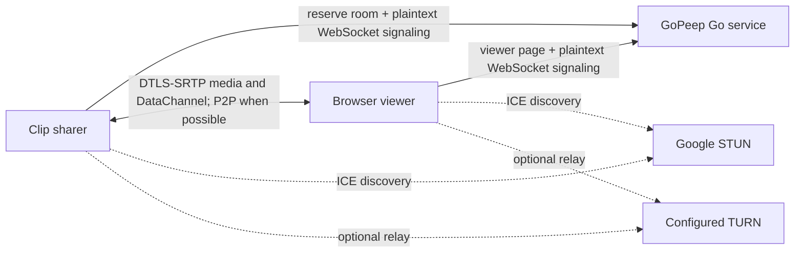
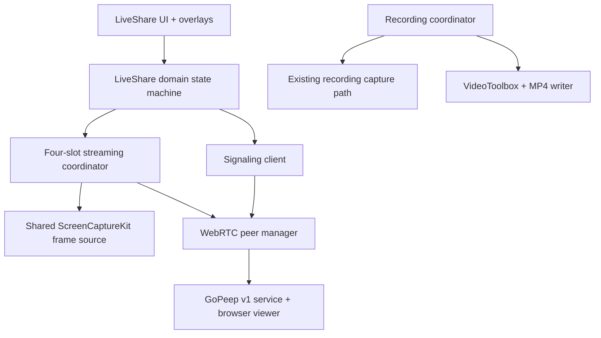

# Clip Live Share architecture

Status: implemented v1 contract plus explicit acceptance boundary for the
`codex/live-screen-share` feature branch

Last updated: 2026-07-19

This document turns the GoPeep audit and the approved Clip product direction into an implementation boundary. It deliberately separates the compatible first milestone from a future signaling design in which the Go server relays opaque data.

The existing recording, Preview, History, export, DMG, and Sparkle update behavior remains the release baseline. Live Share is an additional session mode; it is not a rewrite of recording.

## Implementation and evidence snapshot

The branch now contains the native vertical slice: room reservation and
signaling, one peer per viewer, four stable H.264 tracks, the reliable control
DataChannel, transient ScreenCaptureKit pipelines, the Live Share popover,
focused-window control, fixed HUD, source switching, settings, reconnect, and
bounded viewer/negotiation resources. All feature-specific application code is
under `Clip/LiveShare`; protocol/domain and framework boundaries live in the
three dedicated packages described below.

Automated acceptance uses the unmodified local GoPeep server and its embedded
viewer. An offscreen `WKWebView` has negotiated with Clip's native peer host,
presented advancing H.264 frames, and consumed exact stream, focus, and cursor
control metadata. Native loopback, signaling, domain, capture geometry,
presentation, policy, and deterministic UI suites cover the layers beneath and
around that browser check.

This evidence is deliberately narrower than a release claim. It does not prove
the production coordinator's real desktop ScreenCaptureKit path, overlay
exclusion from real shared pixels, secondary-display/Spaces interaction,
remote Internet or configured-TURN traversal, or a long-running share. The clean-source
stable-signed Release DMG gate is green; the remaining controlled gates are
listed in [live-share-progress.md](live-share-progress.md) and
[ACCEPTANCE.md](ACCEPTANCE.md).

## Product contract

Clip Live Share will:

- share up to four application windows, or one active display, to browser viewers through the existing GoPeep service;
- use the existing ScreenCaptureKit target discovery and native pixel-buffer capture foundation without writing live frames to disk;
- replace the complete menu-bar popover body with a Live Share interface while a live session is being prepared, is ready, is streaming, is reconnecting, or is stopping;
- provide a small Share/Stop control on the currently focused eligible window, with an arrow that moves the control to the opposite lower corner;
- provide a fixed top-right status HUD with four source dots, the connected-viewer count, and a Fullscreen toggle;
- make Fullscreen and window sharing mutually exclusive: enabling Fullscreen stops every window stream before starting the primary-display stream;
- preserve GoPeep's useful source, viewer, connection, quality, frame-rate, codec, password, adaptive-bitrate, quality/performance, auto-share, and stream-stat information in a native Clip presentation;
- use native Swift/AppKit/SwiftUI for Clip UI and ScreenCaptureKit for capture;
- keep all feature-specific code under an obvious `LiveShare` boundary.

The first compatible milestone trusts the existing GoPeep signaling and viewer service. It must not be described as an opaque or zero-trust signaling system. The later v2 direction is documented separately below.

## Audited GoPeep v1 contract

### Topology

GoPeep uses a signaling service to introduce a sharer and one or more viewers. Media is transported over WebRTC, directly when ICE succeeds and through TURN when a TURN server is configured and required.



The production default is `wss://gopeep.tineestudio.se`. Despite the shorthand "GoPeep STUN server," the audited code uses these Google STUN endpoints:

- `stun:stun.l.google.com:19302`
- `stun:stun1.l.google.com:19302`
- `stun:stun2.l.google.com:19302`

GoPeep accepts optional TURN URL, username, password, and force-relay configuration. The Go service itself is the room reservation, signaling, and viewer-web service, not the default STUN service.

### HTTP and WebSocket endpoints

| Purpose | v1 endpoint | Contract |
| --- | --- | --- |
| Reserve room | `POST /api/reserve` | Returns JSON `{ "room": "ADJECTIVE-NOUN-NNN", "secret": "<hex>" }`. An unclaimed reservation expires after five minutes. |
| Signaling | `GET /ws/{ROOM}` upgraded to WebSocket | Client sends a JSON `join` as `sharer` or `viewer`, then exchanges signaling messages. |
| Viewer | `GET /{ROOM}` | Serves the GoPeep embedded `viewer.html`, which joins the room and renders the WebRTC streams. |

The share URL is the configured viewer base URL plus `/{ROOM}`. Clip v1 must derive HTTP/HTTPS and WS/WSS endpoints from one validated service configuration instead of performing string replacements throughout the feature.

### Signaling envelope

The current `SignalMessage` is plaintext JSON. Its fields are:

| Group | Fields |
| --- | --- |
| Routing and role | `type`, `room`, `role`, `peerId`, `error` |
| Session authorization | `password`, `secret` |
| WebRTC negotiation | `sdp`, `candidate` |
| Stream identity | `trackId`, `streams`, `focusedTrack`, `streamAdded`, `streamRemoved`, `streamActivated`, `streamDeactivated` |
| Geometry and cursor | `width`, `height`, `cursorX`, `cursorY`, `cursorInView` |

Each stream descriptor contains `trackId`, `windowName`, `appName`, `isFocused`, `width`, and `height`.

The server-handled message flow is:

| Direction | Message | Meaning |
| --- | --- | --- |
| Sharer → server | `join` with `role: sharer`, `secret`, optional `password` | Claims a reserved room. The server validates the secret and stores the password. |
| Viewer → server | `join` with `role: viewer`, optional `password` | The server validates the room password. |
| Server → client | `joined` | Confirms role and room. |
| Server → viewer | `sharer-ready` | A sharer connected or reconnected. |
| Server → sharer | `viewer-joined` or `viewer-reoffer` | Requests an offer for a new or reconnecting viewer. |
| Sharer → viewer | `offer` | SDP offer, routed by assigned `peerId`. |
| Viewer → sharer | `answer` or `renegotiate-answer` | SDP answer. |
| Both directions | `ice` | ICE candidate; the service uses `peerId` for routing. |
| Sharer → server | `password-update` with `secret` | Replaces or clears the server-stored password. |
| Server → client | `error`, `password-required`, `password-invalid` | Failure or access-code challenge. |

After the WebRTC DataChannel opens, GoPeep sends the following control messages directly between sharer and viewer rather than through the signaling server:

- `sharer-started` and `sharer-stopped`;
- `streams-info` and `focus-change`;
- `stream-added` and `stream-removed` for the renegotiation path;
- `stream-activated` and `stream-deactivated` for preallocated slots;
- `size-change` and `cursor-position`.

GoPeep preallocates four video-track slots. Clip's compatible milestone must preserve the field names, message meanings, and four-slot behavior unless the GoPeep viewer and server are versioned in the same change.

### Media behavior

GoPeep captures BGRA frames with ScreenCaptureKit, encodes each active stream as VP8, VP9, or H.264, and writes the encoded output to a WebRTC video track. It has no audio path. The viewer uses a DataChannel for stream metadata, focus, size, and cursor control.

The audited defaults and choices are:

| Setting | GoPeep values | Default |
| --- | --- | --- |
| Quality soft bitrate | Low 500 kbps; Medium 1.5 Mbps; High 3 Mbps; Very High 6 Mbps; Ultra 10 Mbps; Extreme 15 Mbps; Max 20 Mbps; Insane 50 Mbps | Very High |
| Frame rate | 15, 30, 60 FPS | 30 FPS |
| Codec | VP8, VP9, H.264; H.264 is marked hardware when VideoToolbox is available | VP8 |
| Adaptive bitrate | Off/On | persisted |
| Mode | Performance/Quality | persisted |
| Password | Off/On with generated word-number value | persisted for the session |
| Auto-share | Off/On; follows focused windows and maintains a four-window pool | persisted |

The first Clip milestone locks outgoing video to H.264, which the current GoPeep viewer supports. The native UI shows H.264 and its hardware status as read-only session information rather than offering an unproved codec switch. VP8 and VP9 remain future capability/settings work and are not release requirements.

### Current v1 trust boundary

The GoPeep v1 server can read the sharer secret, room password, SDP, ICE candidates, roles, peer IDs, and signaling errors. It can change or replay signaling data. The browser viewer code is served by that same service. WebRTC protects the negotiated media transport, but v1 does not protect signaling from the service itself.

Additional audited limitations that Clip must not copy as product behavior:

- the generated password has only 2,500 possible values and uses `math/rand`;
- the 128-bit sharer secret falls back to `math/rand` if `crypto/rand` fails;
- the WebSocket server accepts every Origin;
- `Clear All` can leave GoPeep globally marked as sharing with no media;
- deselecting the last source can leave the same empty-sharing state;
- viewer count can include connections that have not reached connected WebRTC state;
- auto-share mutates copied selection state in one path, allowing UI and stream state to drift;
- display/window placement assumes primary-screen coordinates in several paths;
- the overlay event-tap fallback can require permission or pass clicks through;
- no automated tests cover the overlay or end-to-end share lifecycle.

Clip v1 interoperates with this service, but its UI calls the password an access
code and does not claim that it protects against the service operator. An access
code update applies to new join attempts; the v1 server does not reauthenticate a
viewer that already joined, so a prejoined viewer may complete negotiation later.
No silent downgrade from a future secure v2 session to v1 is permitted.

## Clip session model

Live Share owns a state machine independent of `RecordingStateMachine`:

```text
inactive
  → reservingRoom
  → ready
  → startingSources
  → sharingWindows | sharingDisplay
  ↔ reconnecting
  → stopping
  → inactive

Any nonrecoverable step → failed → ready or inactive by explicit user action.
```

Definitions:

- `inactive`: no room, peers, capture sessions, overlays, or live-share popover.
- `reservingRoom`: obtaining the room and sharer secret and opening signaling.
- `ready`: room is available and viewers may wait, but no pixels are being sent. This is not shown as "sharing."
- `startingSources`: at least one source was requested but has not produced a connected stream yet.
- `sharingWindows`: one through four window streams are active or intentionally starting.
- `sharingDisplay`: exactly one primary-display stream is active or intentionally starting.
- `reconnecting`: signaling is retrying while existing peer/media state is preserved when possible.
- `stopping`: new commands are rejected while capture, peers, signaling, overlays, and secrets are torn down.
- `failed`: a visible error with Retry and Stop Session actions; it never masquerades as active sharing.

### Global invariants

- Recording and Live Share are mutually exclusive in the first milestone. `Live Share…` is disabled while recording or finalization is active; recording actions are absent while Live Share is not `inactive`.
- A Live Share room may be `ready` with zero media, but the UI and menu-bar icon must not call it sharing.
- `sharingWindows` has one through four authoritative source IDs. UI selection, dots, capture pipelines, WebRTC slots, and DataChannel metadata derive from that one state.
- `sharingDisplay` has no window source IDs. Enabling it removes every window stream before the display is activated.
- Turning Fullscreen off removes the display stream and returns the room to `ready`; it does not end the room.
- Choosing Share on a window while Fullscreen is active first deactivates Fullscreen, then starts that window.
- Stopping the last window stream returns the room to `ready`; it does not leave an empty `sharingWindows` state.
- `Stop Screen Share` ends the whole session: it tells connected viewers the sharer stopped, closes all peers and capture, clears the room secret/access code from memory, removes overlays, and restores the normal Clip popover.
- Starting, stopping, source changes, reconnects, and stale callbacks are generation-identified and idempotent.
- Live frames and signaling secrets are never written to History, the recording cache, preferences, logs, crash attachments, or analytics.
- A room admits at most eight pending or connected viewer peers. Admission is checked before allocating a peer connection's four video transceivers.
- A viewer must answer an offer within 15 seconds or its native peer is closed and its capacity is released.
- Each negotiation accepts at most 256 local and 256 remote ICE candidates per peer. Candidate strings are limited to 4,096 UTF-8 bytes and structurally validated before reaching libwebrtc; viewer identifiers are limited to 128 bytes. These ceilings are comfortably above ordinary browser ICE gathering while bounding hostile signaling input.
- Room-reservation responses are capped at 16 KiB. Incoming and outgoing
  signaling messages and SDP are capped at 256 KiB by default, with a 1 MiB
  hard configuration ceiling before they can create unbounded native work.
- Control messages are capped at 64 KiB by default and each native DataChannel
  has a 256 KiB high-water limit. Clip does not add an application payload
  queue. Failed durable sends mark that viewer's current authoritative state
  dirty; once libwebrtc reports the native queue below its 50% low-water mark,
  Clip regenerates that latest snapshot with a fresh bounded retry budget.
  Cursor samples are ephemeral and are simply superseded under pressure.

## Menu-bar interface

The ordinary Clip popover gains one `Live Share…` action. Selecting it begins room reservation and replaces the whole popover body. It does not replace `/Applications/Clip.app` during development or affect the installed update-test client.

The live-share popover is one scrollable native view with the following stable sections.

### Header

- `Live Share` title.
- State text: `Connecting…`, `Ready to share`, `Starting…`, `Live · 00:18`, `Reconnecting 2/5…`, `Stopping…`, or the specific error.
- Connected viewer count. Only WebRTC peers in `connected` state count; signaling and `connecting` peers do not.
- Menu-bar icon is neutral in `reservingRoom`/`ready`, red in either sharing state, and uses a warning treatment in `reconnecting`/`failed`.

### Share link

- Full viewer URL and room code.
- `Copy Link` button with transient `Copied` confirmation.
- `Access Code` toggle. When enabled in v1, show and copy the generated value
  and the explicit note `Applies to new viewers; signaling service can read it.`
- The share link and v1 access code remain session values; they are not saved after Stop.

### Sources

- A `Fullscreen` toggle labeled with the active display.
- A `Shared Windows` list showing each active/starting window's app icon, app name, window title, status, and Stop action.
- A `Share Focused Window` action matching the overlay's Share action.
- A four-slot count, for example `2 of 4 windows`.
- In manual mode, stopping/removing a source is immediate and does not stop other sources.
- In auto-share mode, manual window controls are read-only; the currently focused eligible window is added, and the least-recently-focused source is removed before a fifth is added. Fullscreen disables auto-share.

The source picker lists windows, grouped by application. It does not interpret one source as all windows from an application. Fullscreen targets the display containing the focused eligible window, falling back to the primary display. Once Fullscreen starts, that display identity remains stable until Fullscreen stops.

### Stream settings

The popover preserves the GoPeep information without imitating a terminal layout:

- `Quality`: the eight GoPeep presets and bitrates listed above;
- `Frame Rate`: 15, 30, or 60 FPS;
- `Codec`: read-only H.264 status, including hardware status where it is meaningful;
- `Adaptive Bitrate`: Off/On;
- `Mode`: Performance/Quality;
- `Auto-share Focused Windows`: Off/On.

Quality and frame-rate changes apply to active pipelines without replacing source identity. Adaptive bitrate and mode may apply live if the selected WebRTC implementation supports it deterministically. Codec remains H.264 for the complete first-milestone room; a later codec selector requires its own negotiation and browser-interop acceptance. Unsupported live changes are disabled with a short explanation rather than accepted and silently ignored.

Live Share settings have their own persisted namespace. They do not reuse recording's Crisp/Compact/Smallest export values because those are offline file-quality settings with different semantics.

### Viewers and statistics

- Each viewer row shows peer ID, `Connecting`, `P2P`, `TURN`, `Disconnected`, and connected duration as available.
- A `Statistics` disclosure shows uptime and one row per active stream: app/display name, encoded dimensions, delivered FPS, bitrate, bytes sent, and focused marker.
- Statistics are observations and never drive source ownership.

### Session action

- One destructive `Stop Screen Share` button is always reachable without scrolling to a hidden footer.
- During `failed`, the same area shows `Retry` and `Stop Session`.
- Quit first performs the same bounded session teardown, then terminates Clip exactly once.

## Overlay interface

Both overlay types are AppKit-owned, main-actor isolated, excluded from ScreenCaptureKit, available on all Spaces and full-screen Spaces, and removed synchronously from visible UI when a session stops. They use normal `NSWindow`/`NSView` hit testing. Clip will not use a global `CGEventTap`, Accessibility access, Automation, or pointer control for this feature.

### Focused-window Share/Stop control

- Visible only while Live Share is in `ready`, `startingSources`, or either sharing state and there is an eligible focused layer-0 window at least 100 × 100 points.
- Hidden for Clip's own windows, overlays, desktop elements, menu-bar extras, transient panels, and windows that ScreenCaptureKit cannot share.
- Initial size and placement match GoPeep's proven shape: approximately 130 × 32 points, 16 points inside the focused window's lower-left corner.
- Label is `Share` when that exact window is not active and `Stop` when it is starting or active. The button has gray, blue-starting, and red-live state treatments.
- Clicking anywhere on Share/Stop consumes the event and changes that window's stream state; it never passes the click to the underlying app.
- The arrow button consumes the event and animates the control between lower-left and lower-right anchors over 250 ms with an ease-in-out curve.
- Anchor side is retained per window for the current session, so switching focus does not unexpectedly move every overlay.
- Placement converts coordinates using the actual containing display and clamps to its visible frame; it does not assume primary-display coordinates.
- Source identity comes from ScreenCaptureKit/CGWindow identity, not window title alone.

### Fixed status HUD

- Anchored near the top-right of the active display and clamped below its menu bar/notch. While Fullscreen is active, it remains on the shared display instead of following focus to another display.
- Visible whenever the room is `ready` or later, including while no source is active.
- Top row contains four source dots and a viewer icon/count.
- Empty dot: unused slot. Blue dot: source starting. Red dot: source actively sending. When Fullscreen is active, the first dot represents the display and the other three remain empty.
- Viewer count includes connected WebRTC viewers only.
- `Fullscreen` row toggles the primary-display stream. Turning it on removes all window streams first; turning it off returns to `ready`.
- `Stop All` appears only when media is active. It stops all media and returns to `ready`; it does not end the room. This replaces GoPeep's ambiguous `Clear All` behavior.
- HUD actions use visible hover feedback and pointing-hand cursors, and consume their clicks.

## Responsibility and folder boundaries

The implemented source shape is:

```text
Clip/
  App/                         App lifecycle and composition root
  LiveShare/
    Capture/                   Focused-window discovery and cursor context
    Configuration/             Session access code and persisted settings
    Interface/                 Popover model and SwiftUI presentation
    Overlay/                   Focused-window control and fixed status HUD
    Session/                   Composition, orchestration, transitions, teardown

Packages/
  ClipCapture/
    Sources/ClipCapture/        Reusable ScreenCaptureKit discovery, geometry and frames
  ClipLiveShare/
    Sources/ClipLiveShare/      Domain, v1 codec, settings and stable slot policy
  ClipLiveShareWebRTC/
    Sources/ClipLiveShareWebRTC/ Signaling transport, peer host, capture adapter, stats
```

The existing recording source tree was not reorganized in this networking
feature. `ClipCapture` is reusable, but Live Share is its current production
consumer; the proven recording ScreenCaptureKit/VideoToolbox/AVAssetWriter path
remains separate. A later folder or shared-discovery migration must be
mechanical, separately reviewed, and protected by the recording quality and
real-capture suites.

### Ownership rules

| Boundary | Owns | Must not own |
| --- | --- | --- |
| `ClipCapture` | Reusable target discovery, stable source identity, pixel-aligned geometry, ScreenCaptureKit frame delivery, cursor option | AVAssetWriter, History, WebRTC peers, room state |
| Recording | Countdown, pause/resume, VideoToolbox master encoding, MP4 muxing, Preview/History/export lifecycle | Signaling, viewers, live overlays |
| Live Share domain | State machine, authoritative source slots, viewer states, commands, invariants | AppKit, ScreenCaptureKit, WebSocket concrete types |
| Live Share signaling | Room reservation, reconnect policy, v1/v2 message codecs and transport | Capture or UI state mutation |
| `ClipLiveShareWebRTC` | Framework adapters, peer connections, ICE, SDP, H.264 tracks, DataChannel | Source selection policy or SwiftUI |
| Live Share streaming | Mapping capture sources to four WebRTC slots, encoded settings, backpressure, stats | Menu/window presentation |
| Live Share UI | State rendering and user intent dispatch | Network calls, direct capture mutation, secrets in logs |
| Live Share overlay | Window tracking, native hit testing, display-safe positioning | Independent source truth; it dispatches domain commands |

`ClipCapture` exposes a borrowed transient value containing the ScreenCaptureKit
sample/pixel buffer, presentation time, and exact dimensions. Live Share
consumes it synchronously through the WebRTC video-source/encoder adapter and
never routes it through a file writer. Recording keeps its existing transient
capture-to-VideoToolbox/AVAssetWriter pipeline. The two modes share neither a
capture session nor file, cache, or lifecycle state.



### WebRTC dependency boundary

Apple does not ship a public native WebRTC framework. Clip therefore pins [`stasel/WebRTC`](https://github.com/stasel/WebRTC) exactly at `150.0.0` behind the dedicated `Packages/ClipLiveShareWebRTC` adapter. The feature imports the binary framework only through that package; Swift 6 code outside the adapter does not directly depend on its Objective-C concurrency annotations. Implementing WebRTC from scratch is out of scope and a helper Go process would conflict with the desired sandboxed native-app shape.

The dependency choice and version are closed. Release integration records and
verifies:

- selected artifact source and exact pinned version/checksum;
- supported macOS and architectures;
- license notices and binary size;
- Swift 6 concurrency wrapper boundary;
- H.264 browser behavior for the first milestone; VP8/VP9 are future capabilities;
- sandbox and Hardened Runtime compatibility;
- the exact pin during dependency resolution and a complete third-party notice;
- that the former “no bundled media dependencies” invariant is intentionally
  replaced by an audited, pinned WebRTC runtime boundary for Live Share.

The local GoPeep acceptance lane uses the unmodified Go signaling service and
browser viewer, requires advancing H.264 frames, and verifies stream, focus, and
cursor control messages. It proves local browser compatibility without pointer
control. Remote Internet and configured-TURN traversal remain external network
acceptance gates and must not be inferred from the loopback result.

No code should imply that AVFoundation or VideoToolbox alone can provide WebRTC signaling, ICE, DTLS-SRTP, SCTP DataChannels, congestion control, and browser interoperability. The first milestone uses H.264 only even though GoPeep itself exposes VP8 and VP9.

## Future opaque-relay v2

V2 is a separate protocol and server/viewer change. Its goal is for the Go relay to learn only routing identifiers, connection lifecycle, packet size, timing, and network metadata—not passwords, SDP, ICE candidates, stream metadata, or control contents.

### Capability-link default

- The sharer generates a fresh 256-bit invitation secret and a per-session receiver key.
- The viewer URL carries the capability in the URL fragment, for example `https://<trusted-viewer-origin>/<ROOM>#v=2&k=<base64url>&pk=<key>`. URL fragments are not sent in the HTTP request under [RFC 3986](https://www.rfc-editor.org/rfc/rfc3986.html).
- The viewer encrypts its join to the pinned sharer key with HPKE PSK mode as defined by [RFC 9180](https://www.rfc-editor.org/rfc/rfc9180.html). Exported handshake material derives independent viewer-to-sharer and sharer-to-viewer signaling keys.
- Every inner SDP, ICE, stream, and control message is AEAD-encrypted. Protocol version, room, session ID, viewer ID, direction, and monotonically increasing sequence are authenticated associated data. Nonces are unique and replayed/out-of-order sequence numbers outside the allowed window are rejected; see [RFC 5116](https://www.rfc-editor.org/rfc/rfc5116.html).
- The WebRTC DTLS fingerprint is bound to the authenticated invitation/handshake transcript, following the identity-binding requirement in [RFC 8827](https://www.rfc-editor.org/rfc/rfc8827.html).
- Every viewer has independent keys. Disconnect/rejoin creates fresh keys; removing one viewer does not rotate or expose every other viewer's session.

The capability link is a bearer secret: anyone who obtains it may join. The relay can still block, delay, reorder, or discard traffic and can observe IP addresses and traffic shape. Cryptography does not make the relay availability-trustless.

### Optional memorable password

A plain password hash, HMAC challenge, or password-derived encryption key would allow offline guessing and is not acceptable. If memorable passwords remain a requirement, use a standard PAKE:

- preferred: OPAQUE ([RFC 9807](https://www.rfc-editor.org/rfc/rfc9807.html)) with Clip acting as the protocol endpoint and the relay only forwarding KE1/KE2/KE3;
- alternative only after careful role and identity analysis: SPAKE2 ([RFC 9382](https://www.rfc-editor.org/rfc/rfc9382.html)) with explicit roles and key confirmation.

The existing 2,500-value GoPeep password space is inadequate. PAKE also cannot prevent online guessing, so the sharer must enforce attempt limits and generate a materially stronger memorable value. Library availability and an independent cryptographic review are gates; Clip must not implement an ad-hoc PAKE.

### Trusted viewer requirement

A malicious signaling service that also serves mutable viewer JavaScript can steal a URL-fragment capability or password before browser cryptography runs. V2 therefore requires one of:

- a packaged Clip viewer application; or
- an independently hosted, immutable, versioned viewer origin outside the relay's control.

Serving v2 viewer code from the untrusted relay is not compatible with the stated threat model. Subresource Integrity alone cannot protect top-level HTML chosen by that relay.

### Version separation and downgrade resistance

- Use a distinct endpoint or WebSocket subprotocol, such as `/ws/v2/{room}` or `Sec-WebSocket-Protocol: clip-relay.v2`.
- The outer relay envelope contains only protocol version, room routing token, opaque connection ID, `open`/`data`/`close`, and bounded ciphertext length.
- The encrypted inner protocol is independently versioned, for example `clip-liveshare/e2e/v1`.
- V1 and v2 rooms never mix. A v2 invitation never silently retries as v1.
- Version, cipher suite, endpoint role, and application domain are included in the handshake transcript/context to prevent downgrade and cross-protocol use.
- Use fixed binary fields or deterministic CBOR as specified by [RFC 8949](https://www.rfc-editor.org/rfc/rfc8949.html), not hand-rolled JSON canonicalization, for authenticated transcript material.

MLS is not needed for the current one-sharer star topology. Revisit [RFC 9420](https://www.rfc-editor.org/rfc/rfc9420.html) only if Live Share becomes a multi-writer group protocol.

## Explicit non-goals for the first compatible milestone

- No simultaneous recording and Live Share.
- No audio sharing; this matches the audited GoPeep transport.
- No remote keyboard, mouse, clipboard, annotation, or control channel.
- No camera, microphone conference, chat, or viewer-to-viewer media.
- No more than four window streams and no multi-display Fullscreen share.
- No persisted raw frames, live-share recordings, room secrets, or access codes.
- No App Store release work; distribution remains signed DMG plus Sparkle/GitHub Releases.
- No claim that the v1 GoPeep signaling service is opaque, zero knowledge, or protected from its operator.
- No custom WebRTC implementation and no background Go helper executable.
- No VP8/VP9 release requirement or live codec switching in the first milestone.
- No Accessibility, Automation, global event tap, or pointer-control permission.
- No broad recording-directory refactor mixed into the first networking commit; folder migration is a separate behavior-preserving lane.

## Acceptance boundary

### Established automated evidence

- Exact GoPeep v1 reserve, sharer join, access-code join gating/replacement,
  targeted offer/answer, and bidirectional ICE routing run against the
  unmodified local Go service.
- The unmodified served browser viewer negotiates H.264 with Clip's native peer
  host, presents advancing deterministic frames, and consumes stream, focus,
  and cursor control state.
- Unit and native-loopback suites cover stable four-slot identity, fullscreen
  versus window state, reconnect and bounded retry, stale SDP/source
  generations, authoritative control replay, connected-viewer counting,
  signaling queue overflow, viewer admission/answer timeout, and bounded
  validated ICE.
- Deterministic app scenarios exercise the full popover for Ready, Live,
  Reconnecting, Failed, and scrolled-bottom content, plus the overlay/HUD
  presentation, without pointer control or privacy permission.

### Evidence still required before release

- Exercise the production coordinator with real ScreenCaptureKit content at 15
  and 30 FPS. Sixty FPS is an optional capability and is not a release blocker.
- Share one through four real windows, dynamically add/remove and resize them,
  switch to and from Fullscreen, and stress rapid focus/auto-share transitions
  while retaining stable slot identity.
- Prove overlay clicks are consumed, work on a secondary display and Spaces,
  and that neither overlay appears in real shared pixels.
- Exercise a remote Internet path and a controlled configured-TURN relay; only
  then may route reporting be called P2P/TURN verified rather than implemented.
- Exercise sleep/wake, display removal, window closure, permission revocation,
  sustained overload, repeated start/stop, and a ten-minute share without
  leaking capture sessions, peers, sockets, tasks, or overlays.
- Scan runtime logs and storage to confirm no live pixels, SDP, ICE, room
  secret, or access code enters History, caches, preferences, or ordinary logs.
- Rerun the existing recording, Preview, History, export, DMG, and Sparkle
  gates, then verify the final stable-signed sandboxed Release DMG and embedded
  WebRTC framework without replacing the installed app during development.
