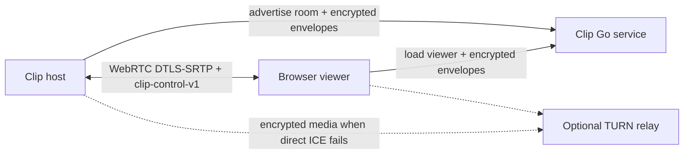

# Clip Live Share architecture

Last updated: 2026-07-20

Wire contract: [Clip Live Share Protocol v1](clip-live-share-protocol-v1.md)

Acceptance: [ACCEPTANCE.md](ACCEPTANCE.md)

Progress: [live-share-progress.md](live-share-progress.md)

## Product boundary

Live Share is a deliberate network mode, separate from recording. It can share
up to four exact application windows or one fullscreen display with browser
viewers. It does not create a recording, write frames to History, or reuse the
recording/export writer.

The host can keep a room open with no active source, add and remove sources,
switch codec or cadence, and stop and resume media without changing the viewer
link. Live Share and recording are mutually exclusive. Live Share captures no
microphone audio.

The implementation is native Swift and ScreenCaptureKit in Clip, a pinned
native WebRTC runtime for browser transport, and an in-repository Go server
with an embedded HTML/JavaScript viewer. There is one supported signaling
contract: `clip-live-share` version 1. There is no compatibility fallback.

## Topology



The server has three responsibilities:

1. Keep an in-memory set of advertised room names and owner-token hashes.
2. Serve the embedded viewer and public deployment capabilities.
3. Route bounded opaque signaling envelopes between one host and a temporary
   viewer route.

Clip owns admission, source state, viewer count, WebRTC peers, media, and all
user-facing session behavior. Once a viewer's reliable ordered
`clip-control-v1` DataChannel opens, that viewer's signaling WebSocket closes.
Control and later renegotiation then travel over WebRTC. ICE may select either
a direct route or a configured TURN relay; both keep the media and DataChannel
encrypted end to end.

## Repository boundaries

```text
Clip/
  App/                          App lifecycle and composition root
  LiveShare/
    Capture/                    Focus and cursor context
    Configuration/              Persisted defaults and endpoint validation
    Interface/                  Popover state and SwiftUI presentation
    Overlay/                    Focused-window control and fixed HUD
    Session/                    Session orchestration and teardown

Packages/
  ClipCapture/                  Reusable ScreenCaptureKit discovery and samples
  ClipLiveShare/                Protocol, crypto, domain state and slot policy
  ClipLiveShareWebRTC/          Signaling transport and native WebRTC adapters

server/
  cmd/clip-live-share-server/   Go process entry point
  internal/config/              Deployment configuration
  internal/http/                HTTP, WebSocket and embedded-viewer surface
  internal/protocol/            Strict outer-envelope validation and limits
  internal/registry/            In-memory room ownership and leases
  internal/signaling/           Per-route opaque relay
  web/                          Browser viewer, crypto and browser tests
  scripts/                      Docker Hub publication
```

Recording remains in its existing source tree. Sharing target discovery and
transient ScreenCaptureKit delivery are reusable, but Live Share never routes a
sample through VideoToolbox's recording writer, AVAssetWriter, Preview,
History, or export caches.

| Boundary | Owns | Must not own |
| --- | --- | --- |
| `ClipCapture` | Target discovery, exact geometry, transient video and 48 kHz stereo system-audio delivery | File writing, room state, peers or UI |
| Recording | Countdown, pause/resume, master encoding, MP4 muxing and post-capture lifecycle | Rooms, signaling or viewers |
| `ClipLiveShare` | Typed identifiers, encryption, message validation, state machine and source-slot policy | AppKit, ScreenCaptureKit or concrete sockets |
| `ClipLiveShareWebRTC` | HTTP/WebSocket signaling adapter, ICE, SDP, peers, codecs, RTP stats, Opus and DataChannel | Source-selection policy or SwiftUI |
| Live Share coordinator | Admission, authoritative sources, capture-to-peer mapping, reconnect and teardown | Persistent media or server-side viewer truth |
| Go server | Room-name leases, owner-token hashes, viewer routes and bounded ciphertext relay | Access codes, SDP, ICE, stream metadata, media or viewer count |
| Browser viewer | Key agreement, admission UI, peer answer, stream presentation, audio playback and control state | Host source authority or server room ownership |

## Room creation and ownership

Clip fetches `/.well-known/clip-live-share`, validates protocol version 1 and
resource limits, then generates:

- a memorable, normalized room name;
- a random 32-byte owner token; and
- an ephemeral P-256 room key pair.

`PUT /api/v1/rooms/{room}` advertises the room with the owner token. The server
stores only SHA-256 of that token. The token authenticates the host WebSocket,
idempotent re-advertisement, reconnect, and room deletion. It is not placed in
the viewer URL or persisted after the session.

Room state is memory-only. An advertisement has a bounded lease, a connected
host renews it, and a brief disconnect grace lets the same owner reclaim it.
Pending viewer routes close on host loss. A server restart deliberately clears
rooms; Clip reconnects and re-advertises the active room using the same owner
capability.

The initial deployment uses one server replica. Horizontal replication would
require shared ephemeral routing or connection affinity and is outside v1.

## Why the URL fragment key matters

The share URL has this shape:

```text
https://share.example/ROOM#v=1&key=<P-256-public-key>
```

The value after `#` is a URL fragment. A browser uses it locally but does not
include it in the HTTP request for `/ROOM`. It is the host's ephemeral public
key, not the owner token, access code, or a symmetric encryption secret.

For every route, the browser creates its own P-256 key pair and sends only its
public key through the relay. Browser and host perform ECDH and derive separate
viewer-to-host and host-to-viewer AES-256-GCM keys with HKDF-SHA256. Room,
route, direction, version, and sequence are authenticated. A relay that merely
forwards the prescribed viewer cannot read or silently modify admission, SDP,
ICE, or stream/control metadata.

The fragment also pins the expected host identity for this ephemeral room. A
relay cannot substitute another host key without the browser noticing, as long
as the loaded viewer code follows the protocol.

This boundary is important:

- The fragment is not a password. A room without an access code intentionally
  admits anyone who has a working share link and whom the host accepts.
- The browser viewer is trusted as part of the selected deployment. A server
  operator who replaces the top-level HTML or JavaScript can read
  `location.hash` before cryptography runs.
- TLS is still required on the Internet to protect viewer delivery and normal
  web metadata.
- Self-hosting is the trust option for a user who does not trust the default
  viewer deployment.
- The relay can always deny service, delay packets, observe IP addresses and
  traffic shape, or serve no viewer. End-to-end encryption does not provide
  availability or traffic-analysis resistance.

## Viewer admission

The server does not know whether a room uses an access code. Admission happens
inside the encrypted route before Clip allocates a peer:

1. Clip sends a random 32-byte challenge and whether a code is required.
2. The viewer asks locally for the code when required.
3. The browser returns an HMAC-SHA256 proof over the challenge and per-route
   session identifier, keyed from the normalized code.
4. Clip verifies the proof in constant time and sends the result.
5. Only an allowed route proceeds to SDP negotiation.

Changing the code affects new admissions. It does not eject an already
connected peer. Attempts, pending routes, message sizes, ICE candidates and
answer time are bounded. Code text and plaintext proofs never reach the
server.

The access code is a convenient host-side gate, not an account system. It is
session-only and never written to preferences, History, caches or normal logs.

## Encrypted signaling lifecycle

Outer WebSocket messages contain only version, route ID, sequence, random
nonce, bounded ciphertext and lifecycle/error codes. The relay enforces strict
JSON, canonical identifiers, monotonic sequence and a 262,144-byte frame
ceiling without decrypting payloads.

The decrypted inner ceiling is 196,400 bytes, leaving room for the AES-GCM tag,
base64url expansion and JSON envelope. Both sides reject invalid tags,
duplicates, gaps, route mismatch, oversized payloads and unexpected state.

Initial `offer`, `answer`, and ICE messages carry a session ID and unique
negotiation ID inside encryption. After the browser observes `clip-control-v1`
open, it sends `close-route` and closes its viewer signaling WebSocket. Clip
treats that browser-initiated closure as the completed handoff and preserves the
established peer. A later codec/source renegotiation travels over that
DataChannel. A genuinely failed ICE transport may establish a fresh encrypted
route with new viewer keys.

Established WebRTC peers survive a host signaling-WebSocket reconnect. The
server does not infer connected viewers from WebSocket presence; Clip counts
connected peer state.

## Media and source identity

Each viewer gets an independent peer connection. Clip preallocates four video
send slots for the product's four-window limit plus one optional Opus system
audio track. The protocol does not expose fixed `video0` names or derive stream
meaning from SDP `mid` values. Stream and media-track identifiers are random
per Live Share session, and authoritative encrypted manifests bind each active
source to its negotiated track.

Exact windows are the source unit. Fullscreen is exclusive:

- enabling Fullscreen stops all window capture first;
- adding a window turns Fullscreen off first; and
- stopping the last source leaves the room available.

Capture samples remain borrowed and transient. A two-frame video handoff keeps
latency bounded. Old-generation or wrong-size frames are rejected rather than
silently scaled. Pressure and drops are observable in session statistics.

H.264 uses hardware encoding and aspect-fits only geometry outside the safe
encoder envelope. VP8, VP9 profile 0 and AV1 use native source geometry. VP8 is
the default. H.264 and VP8 are exact preferences; VP9 may negotiate VP8 when a
viewer lacks VP9, and AV1 may negotiate VP9 or VP8. Each viewer negotiates
independently, so actual outbound RTP statistics are authoritative. AV1 may use
more CPU despite its useful quality/latency result on capable hardware.

Fifteen and 30 FPS are supported choices. Sixty FPS is capability-gated and is
not a release requirement.

## System audio

System Audio defaults to Off and persists independently from recording audio.
For window sources, ScreenCaptureKit captures audio for the unique owning
applications of all active windows. This is application-scoped, so macOS cannot
isolate one window from another window owned by the same application.
Fullscreen captures system audio while excluding Clip. Multiple windows from
one application never duplicate the audio capture or WebRTC track.

ScreenCaptureKit supplies 48 kHz stereo PCM to Clip's native audio-device
bridge, which feeds one stable Opus send track. No microphone track is created.
The browser viewer attaches the remote audio track and exposes mute and volume.
When autoplay policy blocks sound, the UI presents a user-gesture action to
enable it. The stable negotiated track alone does not make those controls
available: Clip publishes authoritative `system-audio-state` only after capture
reconciliation succeeds, and disables the controls on capture stop or failure.
Audio, like video, is transient and never sent through History.

## Control state and backpressure

The reliable ordered `clip-control-v1` DataChannel carries versioned messages
for:

- authoritative stream manifests;
- sharing state and focused source;
- authoritative system-audio state;
- geometry changes;
- normalized cursor position;
- codec/source renegotiation; and
- session or route closure.

Durable state is regenerated from the latest authoritative snapshot after the
native channel drains below its low-water mark. Clip does not build an
unbounded application payload queue. Cursor samples are ephemeral and may be
superseded. Inbound viewer control is validated by type, session, bounds and
the viewer's allowed authority; it cannot remotely control the Mac.

## Interface and overlays

Starting Live Share replaces the recording popover with session-specific
content:

- room link and Copy action;
- host-verified access-code controls;
- sources and Fullscreen state;
- quality ceiling, FPS, codec, focus prioritization, encoding mode, auto-share
  and System Audio;
- connected viewers and per-source statistics; and
- Stop Sharing/End Session or Retry actions.

Settings owns one validated server base address. Test Connection only fetches
capabilities; it does not advertise a room. Reset Server Address restores
`https://clip.tineestudio.se`. Changes affect the next session and never
retarget an active one.

The focused eligible window receives a capture-excluded Share/Stop chip. Focus
changes move it immediately to the new window; only the arrow's left/right
anchor change animates. Clip-owned windows, transient panels, sheets, menus,
desktop elements, protected content and unshareable windows are excluded.

A fixed capture-excluded HUD appears near the active display's top-right. It
shows four source indicators, connected viewer count, Fullscreen and Stop All.
Both overlays use ordinary AppKit hit testing, consume their own clicks, work
without Accessibility/Automation/global event taps, and are removed
synchronously when the session ends.

Auto-share may track only the current eligible focused window. Manual source
management remains available. Focus and cursor context refer only to active,
authoritatively manifested sources.

## Server deployment

The top-level `server` module requires Go 1.25 or newer. Development defaults
to `:8080`; Clip uses `http://localhost:8080`. Internet deployments must put
the service behind HTTPS/WSS TLS termination and use a single replica.

The server is configured through environment variables for listen address,
lease and reconnect timing, route idle timeout, room/connection ceilings,
allowed browser origins and advertised ICE servers. TURN credentials, if any,
are deployment inputs delivered in capabilities; use scoped, short-lived
credentials where possible.

The Docker image is multi-stage, CGO-free and non-root. Its health check uses
`/healthz`. `server/scripts/publish-docker.sh VERSION` publishes `linux/amd64`
and `linux/arm64` tags with provenance and SBOM through Buildx. See
[`server/README.md`](../server/README.md) for exact configuration.

## WebRTC dependency boundary

Apple does not provide a public native WebRTC framework. Clip builds the
pinned upstream WebRTC M150 source revision and publishes the reviewed arm64
XCFramework as a dedicated, immutable GitHub Release dependency behind
`Packages/ClipLiveShareWebRTC`. Other Swift targets do not import its
Objective-C concurrency surface directly.

Clip maintains a source patch against WebRTC M150 for Rec.709 fidelity. It
maps captured `420v`/`420f` frames to limited/full Rec.709, writes AV1 CICP,
preserves decoded color metadata across the Objective-C bridge, and selects
the matching conversion in the macOS Metal renderer. The ignored local binary
override is for development validation only; release packaging rejects it and
resolves the exact public checksummed dependency into an isolated cache.

Release packaging verifies the exact artifact pin and checksum, normalized
framework payload, architectures, license notice, sandbox/Hardened Runtime
compatibility, nested signatures and runtime paths. This dependency is only
for Live Share; recording/export remains native VideoToolbox and AVFoundation
without FFmpeg, libx264, or a helper media process.

## Privacy and persistence

The service may observe room names, IP addresses, connection times, temporary
route identifiers and envelope sizes. It does not receive plaintext access
codes, SDP, ICE candidates, codecs, source names, stream manifests, cursor
positions, media, or authoritative viewer count.

No Live Share frame, PCM sample or network encoding is persisted. Owner tokens,
room private keys, viewer keys, challenges and access codes remain session
memory only. Ordinary logs contain bounded error categories and identifiers,
not ciphertext contents or secrets. Stopping a session tears down capture,
audio, observers, overlays, peers, routes and the room advertisement.

## Explicit non-goals

- No simultaneous recording and Live Share.
- No microphone, camera, chat, conference, annotation, remote input, clipboard
  or viewer-to-viewer media.
- No more than four window sources or more than one fullscreen display.
- No persistent room history or live-share recording.
- No claim that the relay hides traffic shape or guarantees availability.
- No multi-replica routing in protocol v1.
- No custom replacement for WebRTC.
- No requirement that every browser decode VP9 or AV1.
- No Accessibility, Automation, global event tap or pointer-control permission.
- No native Clip viewer in this milestone. A future native receiver can reuse
  the same WebRTC and encrypted signaling protocol if measurement justifies it.

## Acceptance boundary

The deterministic local lane builds and tests the in-repo Go service, validates
the embedded viewer and browser crypto, launches the actual server on loopback,
checks health/version/capabilities/viewer delivery, and runs both native Live
Share package suites. It needs no privacy permission, installed app, sibling
repository or pointer control.

Unit/integration evidence covers typed protocol bounds, cross-language crypto
vectors, replay/tamper rejection, room ownership and leases, origin policy,
real localhost WebSocket routing, encrypted signaling reconnect, source/peer
state, codec negotiation, DataChannel backpressure, Opus input and teardown.

The local lane does not prove production ScreenCaptureKit permission, real
desktop/audio quality, overlay exclusion, Spaces/display behavior, hostile
network traversal, configured TURN, sleep/wake, permission loss, long soak,
published service availability, or final signed-DMG packaging. Those remain
explicit controlled or release gates on the progress board.
